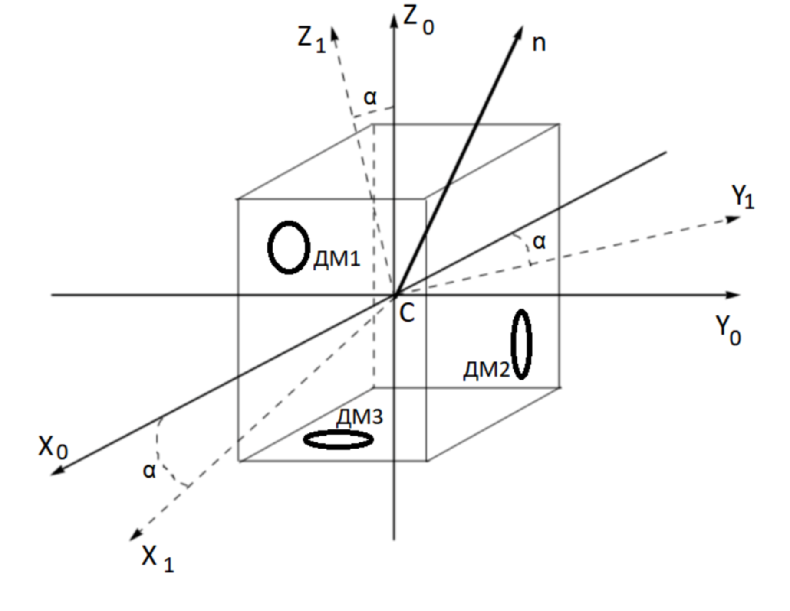
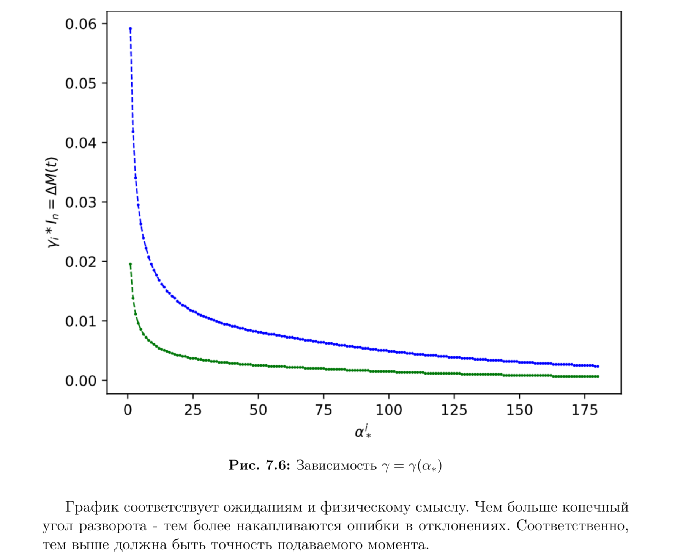
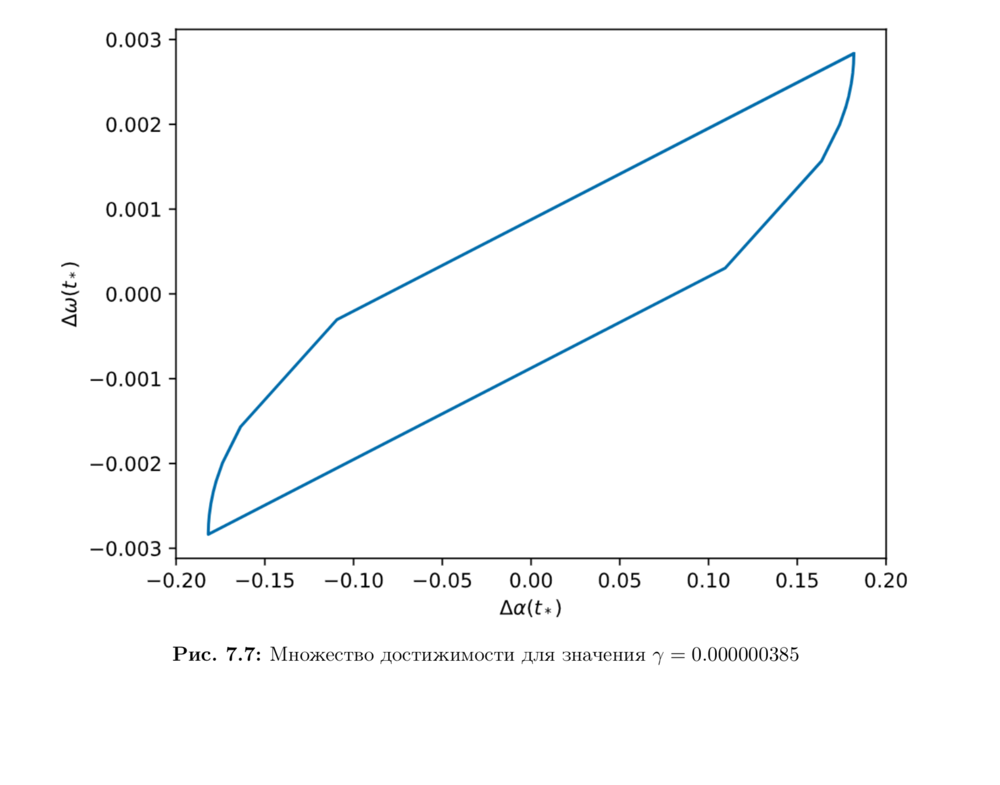

### _Introduction_

This is the coursework I created together with [Lebedev A.V.](http://www.mathnet.ru/php/person.phtml?option_lang=eng&personid=139099) describing 
the algorithm that was being used on Russian satellites in the middle of 80-90 years.

In the second part I analyze the accuracy of the given algorithm using [Pontryagin's maximum principle](https://en.wikipedia.org/wiki/Pontryagin%27s_maximum_principle).
Te main results are partly depicted below.

See more details [here](./ResearchAlgoDescription.pdf) for the reference to actual algorithm description and [here](./ResearchAlgoAccuracy.pdf) for the accuracy results.
